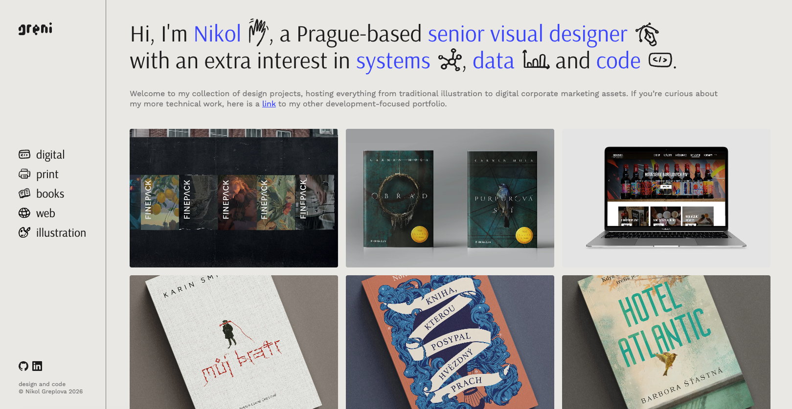
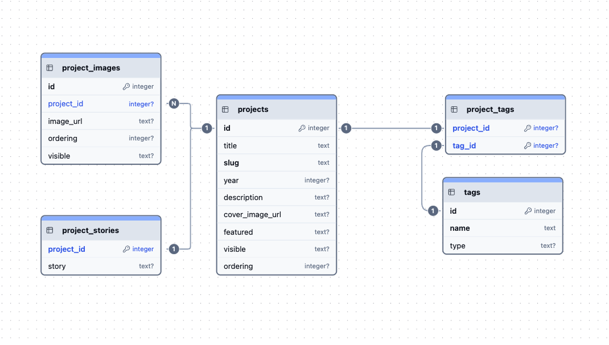

# Design Portfolio

A small full-stack app for my graphic-design portfolio. It manages my projects as structured content in a database rather than hardcoded pages, so the work stays organised and easy to filter, extend, and grow.

**Live at [design.greni.dev](https://design.greni.dev)** 

## Overview

Rather than storing data in JSON static files, I chose an architecture with a clear mental model and potential for scalability and easy adjustments. For the future, I would like to have features like an admin UI, contact form or a blog, so I wanted to support those ideas from the get go.

Each project is a record with structured attributes — title, slug, year, short description, tags, tools, images, and a long-form story. For having an overview of many projects at once, I prefer the experience of managing them as a database: seeing their relationships easily, managing the attributes, filtering with simple SELECT rather than looping on the frontend etc.

As for the overall look and layout, highlighting design is of course the priority: People should see my work at first glance and be able to find what they're looking for specifically with ease (hence the horizontal menu). The hard part was of course that a clean layout could quickly become pretty bland and template-looking, so I tried to bring in a few personal touches with hand-drawn icons and transitions.

## Architecture

The repo is a monorepo split into a `client/` (frontend) and a `server/` (backend), deployed separately. Images are hosted on Cloudinary, and the live frontend talks to the API over a base URL set via a Vite environment variable (`VITE_API_URL`).

### Frontend — `client/`

React 19 + TypeScript, built with Vite and styled with Tailwind v4. React Router drives a `Layout` shell with nested routes (a homepage `Main` index and a `/:slug` project detail page). Components are organised by role into `layout/`, `sections/`, and `ui/`.

The flow of data, split on purpose by concern: the homepage fetches a list of projects (basic information), and the full project story, tags, and gallery images are fetched lazily, per project, only when someone opens it. The logic behind this decision is that most people browsing a portfolio only click into a couple of projects, so there's no reason to ship every markdown on the first render.

Project stories are written in markdown (for my ease of editing) and rendered with `react-markdown`. Where mobile and desktop require logically different components (the menu and the project detail page) I use conditional rendering on viewport width rather than CSS breakpoints alone, keeping each version as its own clearly separated block. (For the future, I would refactor into separate components to clean this up.)

### Backend — `server/`

A Flask JSON API over a SQLite database, using `sqlite3` directly with parameterised queries and `flask-cors` to allow the browser to call the API across origins. `CORS(app)` is appropriate here because this is a public, read-only API with no per-user data.

API endpoints:

- `GET /api/projects` — the homepage list (featured projects, ordered); accepts an optional `?tag=` to return a filtered category view
- `GET /api/detail?slug=` — full detail and story for one project
- `GET /api/tags?slug=` — a project's tags, grouped by type
- `GET /api/images?slug=` — a project's ordered gallery images

In production the app is read-only (which I think is appropriate for a portfolio site), so the pre-seeded SQLite database is committed directly to the repo instead of running migrations against a managed database. 

## Database

- **`projects`** — the overview record (title, slug, year, description, cover image, plus `featured` / `visible` / `ordering` flags)
- **`project_stories`** — the long-form markdown writeup, strict 1:1 relationship, loaded only on the detail page (preferred to separate concerns here and not have a huge text in my SELECT * FROM projects when doing quick overviews)
- **`project_images`** — additional gallery images, a 1:many relationship with their own `ordering` and `visible` flag, so a project's gallery is easy to reorder and update
- **`tags`** — typed as `category`, `tool`, or `industry`, so the detail page can group them + their own table for easy changes
- **`project_tags`** — the many-to-many join between projects and tags

The `featured`, `visible`, and `ordering` flags handle curation. `featured` is the homepage selection, picking a few projects per category for first impression + `visible` lets me keep WIP projects in the system but hidden until they have proper mockups and copy.

## Managing content

Rather than build an admin UI at the start, content lives in version control and is loaded by a seed script — a pragmatic middle path to get a usable MVP live quickly, given that I'm the only person who will ever update this portfolio. This structure lets me build the admin portion on top of it, rather than replacing static solutions.

The workflow:

- Project metadata, tags, and image URLs live in CSVs under `server/seeds/`.
- Each project's story is a markdown file named by its slug in `server/seeds/projects/`.
- `seed.py` reads the CSVs and markdown files and populates the database

## What's next

- A small admin UI for editing projects directly, replacing the spreadsheet-and-seed workflow.
- Further separating the mobile/desktop blocks into their own component exports for cleaner structure.
- Motion and interaction polish (GSAP) to add more personality and interest.
- A blog section, perhaps an elaborate about section, contact form etc.
